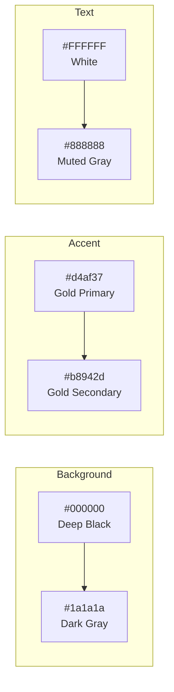
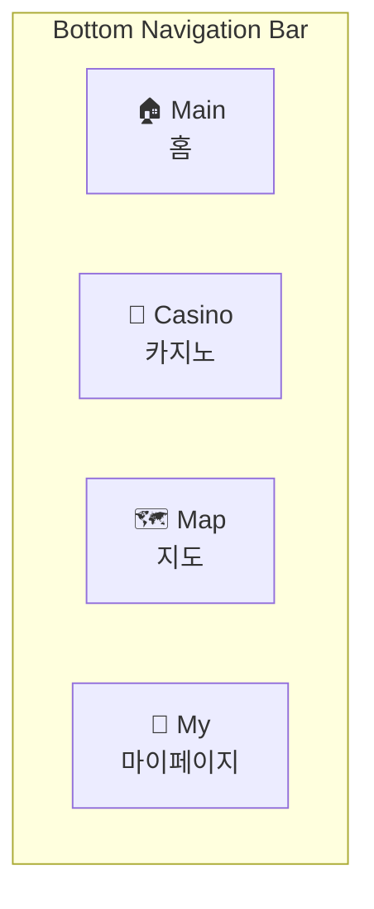

# 컨셉 D 분석 문서

> [!NOTE]
> 본 문서는 [Figma 사이트](https://pecan-vector-59113274.figma.site/)를 분석하여 작성되었습니다.

---

## 1. 컨셉 (Concept)

### 디자인 컨셉: **Luxury & Modern Dark**

고품격 리조트의 프리미엄 이미지를 강조하기 위해 **다크 모드(Black)** 기반에 **골드(Gold)** 포인트를 적용한 럭셔리하고 현대적인 브랜드 아이덴티티입니다.

### 핵심 스타일 요소

| 요소 | 설명 |
|------|------|
| **카드 기반 레이아웃** | 각 섹션을 라운드 처리된 카드 형태로 구성하여 가독성과 정돈된 느낌 제공 |
| **모바일 앱 중심 UI** | 하단 탭 바(Bottom Navigation Bar)를 배치하여 전용 앱 사용자 경험 제공 |
| **강조된 타이포그래피** | 굵은 산세리프 서체로 주요 정보 전달, 한글+영문 병행 표기로 글로벌 분위기 연출 |
| **그라데이션 버튼** | CTA 버튼에 골드 그라데이션 적용으로 주목도 극대화 |
| **프로그래스 바** | 카지노 미션 등에서 골드 컬러 바로 달성률 표현 |

---

## 2. 컬러 (Color Palette)

### 주요 색상 (Primary Colors)

```
┌─────────────────────────────────────────────────────────┐
│  Gold Accent (골드 포인트)                               │
│  ━━━━━━━━━━━━━━━━━━━━━━━━━━━━━━━━━━━━━━━━━━━━━━━━━━━━━  │
│  #d4af37  /  #b8942d                                    │
│  로그인 버튼, 주요 아이콘, 활성화 메뉴, 강조 텍스트        │
└─────────────────────────────────────────────────────────┘
```

### 배경 색상 (Background Colors)

| 색상명 | HEX 코드 | 용도 |
|--------|----------|------|
| Deep Black | `#000000` | 전체 배경 |
| Dark Gray | `#1a1a1a` ~ `#2a2a2a` | 카드 배경, 입력창 배경 (입체감 부여) |

### 텍스트 및 보조 색상 (Text & Neutral Colors)

| 색상명 | 용도 |
|--------|------|
| **Pure White** | 본문 및 제목 텍스트 (높은 대비 확보) |
| **Muted Gray** | 보조 설명, 비활성 아이콘 |

### 컬러 활용 다이어그램



---

## 3. 메뉴 구성 (Navigation Structure)

### 메인 네비게이션 (하단 탭 바)



#### 각 메뉴별 상세 구성

| 메뉴 | 주요 기능 |
|------|-----------|
| **Main (홈)** | 환영 메시지, 로그인 유도, 퀵 메뉴, 타임세일, 주요 시설 정보 |
| **Casino (카지노)** | 잭팟 금액 현황(Live Status), 포인트 적립 상태, 오늘의 미션 |
| **Map (지도)** | 리조트 내 매장/시설 검색, 카테고리별 필터 (다이닝, 쇼핑, 아레나, 호텔, 편의시설) |
| **My (마이페이지)** | 로그인/회원가입, 멤버십 혜택, 포인트 확인 |

---

### 홈 화면 퀵 메뉴 (Quick Menu)

| 아이콘 | 메뉴명 |
|--------|--------|
| 🅿️ | 주차/셔틀 안내 |
| 📋 | 출입 준비물 |
| 💳 | 멤버십 사전 개설 |
| 🔔 | 알림 설정 |
| 🎫 | 티켓 목록 |

---

### 상단 유틸리티 메뉴

| 아이콘 | 기능 |
|--------|------|
| 🌐 | 언어 설정 |
| 🔔 | 알림함 |

---

## 4. 주요 페이지 스크린샷

````carousel

<!-- slide -->

<!-- slide -->

<!-- slide -->

<!-- slide -->

<!-- slide -->

````

---

## 5. 분석 녹화 영상

아래 영상은 Figma 사이트 분석 과정을 녹화한 것입니다:


---

## 요약

**컨셉 D**는 **다크 모드 + 골드 포인트**를 활용한 **럭셔리 & 모던** 디자인 컨셉으로, 고급 리조트 브랜드 이미지에 적합한 UI/UX를 제공합니다. 카드 기반 레이아웃과 하단 탭 내비게이션을 통해 모바일 앱 경험을 극대화하였습니다.
